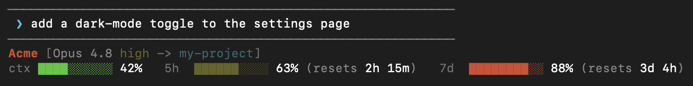

<div align="center">

<picture>
  <source media="(prefers-color-scheme: dark)" srcset="./assets/ccbar-logo-horizontal-dark.svg">
  
</picture>

**A configurable status line for [Claude Code](https://claude.com/claude-code)**<br>
See your model, effort level, workspace, and live usage at a glance.

[](https://www.npmjs.com/package/ccbar-cli)
[](./LICENSE)
[](#requirements)

**English** · [简体中文](docs/README.zh-CN.md) · [Español](docs/README.es.md) · [हिन्दी](docs/README.hi.md) · [Português](docs/README.pt-BR.md) · [日本語](docs/README.ja.md) · [Français](docs/README.fr.md) · [한국어](docs/README.ko.md) · [සිංහල](docs/README.si.md)

</div>

---

`ccbar` renders a compact two-line status line under your Claude Code prompt:

<p align="center">
  
</p>

- **Line 1** — an optional org/label badge, the model name, the current effort level, the workspace directory, and (optionally) the running **session cost**.
- **Line 2** — colored usage bars for your **context window**, **5-hour** rate limit, and **7-day** rate limit, each with a countdown to when it resets.

Bars turn 🟢 green → 🟡 yellow → 🔴 red as they fill, so you can see at a glance how much headroom you have left.

Two extras help you manage your rate-limit windows:

- **Idle 5-hour window** — before you've sent your first message the 5-hour window hasn't started, so ccbar shows `5h idle` to signal the clock isn't running. (Claude's 5-hour limit is a rolling window anchored to your first message — sending a quick throwaway prompt while idle starts the window early and shortens any eventual wait.)
- **Burn-rate warning** *(opt-in)* — when your current pace projects to exhaust a limit *before* it resets, ccbar appends a `⚠ <time>` estimate to that bar. Off by default; enable it in `ccbar config`.

Beyond the status line, ccbar gives you two terminal commands: **[`ccbar stats`](#usage-insights)** for an expanded usage panel, and **[`ccbar history`](#usage-insights)** for 7-day usage trends.

---

## Install

```sh
npx ccbar-cli
```

Or with curl:

```sh
curl -fsSL https://raw.githubusercontent.com/lakpriya1s/ccbar/main/install.sh | bash
```

The installer will:

1. Install the `ccbar` script to `~/.local/bin/ccbar`.
2. Wire it into `~/.claude/settings.json` as your status line (backing up the file first).
3. Run an **interactive setup wizard** so you can pick your label, segments, theme, and bar style.

Then **start a new Claude Code session** (or restart it) to see your status line.

> Prefer not to pipe to `bash`? See [Manual install](#manual-install).

## Requirements

- **bash** (macOS's built-in 3.2 is fine) and coreutils `date`
- **[jq](https://jqlang.github.io/jq/)** — used to read Claude Code's status JSON and to safely edit your settings
  - macOS: `brew install jq`
  - Debian/Ubuntu: `sudo apt-get install jq`
  - Fedora: `sudo dnf install jq` · Arch: `sudo pacman -S jq` · Alpine: `sudo apk add jq`

## Configuration

Run the wizard anytime:

```sh
ccbar config
```

It writes a plain, hand-editable file at `~/.config/ccbar/config`:

| Key                 | Default | Description                                                        |
| ------------------- | ------- | ------------------------------------------------------------------ |
| `CCBAR_ORG`         | *(empty)* | Label shown at the front (e.g. your company). Blank hides it.    |
| `CCBAR_THEME`       | `default` | Color theme: `default`, `mono`, or `vivid`.                      |
| `CCBAR_BAR_WIDTH`   | `10`    | Width of each usage bar, in cells.                                 |
| `CCBAR_BAR_FILLED`  | `█`     | Character for the filled portion of a bar.                         |
| `CCBAR_BAR_EMPTY`   | `░`     | Character for the empty portion of a bar.                          |
| `CCBAR_SHOW_EFFORT` | `1`     | Show the effort level (`1`/`0`).                                   |
| `CCBAR_SHOW_CTX`    | `1`     | Show the context-window bar (`1`/`0`).                             |
| `CCBAR_SHOW_5H`     | `1`     | Show the 5-hour usage bar (`1`/`0`).                               |
| `CCBAR_SHOW_7D`     | `1`     | Show the 7-day usage bar (`1`/`0`).                                |
| `CCBAR_SHOW_COST`   | `0`     | Show the running session cost on line 1 (`1`/`0`).                 |
| `CCBAR_SHOW_BURN`   | `0`     | Warn (`⚠ <time>`) when your pace will exhaust a limit early (`1`/`0`). |
| `CCBAR_HISTORY`     | `1`     | Record usage snapshots for `ccbar history` (`1`/`0`).              |

Every value has a sensible default, so a missing or partial config still renders fine.

### Themes

| Theme     | Look                                   |
| --------- | -------------------------------------- |
| `default` | Subtle, dimmed colors (recommended)    |
| `mono`    | Grayscale only — blends into any prompt |
| `vivid`   | Bright, high-contrast colors           |

## Commands

Show an expanded usage panel (see [Usage insights](#usage-insights)).

```sh
ccbar stats
```

Show 7-day usage trends (see [Usage insights](#usage-insights)).

```sh
ccbar history
```

Run the interactive setup wizard.

```sh
ccbar config
```

Browse preset looks and optionally apply one.

```sh
ccbar gallery
```

Preview with sample data — the status line, or (with `stats`/`history`) either usage panel.

```sh
ccbar demo
ccbar demo stats
ccbar demo history
```

Read Claude Code's status JSON on stdin and print the bar (this is what Claude Code itself calls).

```sh
ccbar render
```

Remove ccbar's wiring from Claude Code settings.

```sh
ccbar uninstall
```

Print the version.

```sh
ccbar version
```

Show help.

```sh
ccbar help
```

> The `ccbar` command lives in `~/.local/bin`. If that's not on your `PATH`, add it:
> ```sh
> echo 'export PATH="$HOME/.local/bin:$PATH"' >> ~/.zshrc   # or ~/.bashrc
> ```
> The status line itself uses an absolute path, so it works regardless of your `PATH`.

## Usage insights

ccbar makes **no network calls** and has **no credentials** — it only ever sees the JSON Claude Code pipes to `ccbar render`. To make that data useful outside the status line, `render` caches the latest payload (and records a small rolling history), which two commands read back. Try them with sample data via `ccbar demo stats` and `ccbar demo history`.

### `ccbar stats`

An expanded, on-demand usage panel — model, session (5h), weekly (7d), context, cost, reset countdowns, and your current pace:

```
ccbar — usage

  Model     Opus 4.8 (high)
  Session   ██████░░░░ 63%   resets in 2h 15m
            hits limit in ~1h 36m
  Weekly    ████████░░ 88%   resets in 3d 4h
  Context   ████░░░░░░ 42%   84k / 200k
  Cost      $0.42
  Updated   12s ago
```

It reads the most recent payload Claude Code handed to `ccbar render` (captured on every redraw and stamped with how long ago). Pipe fresh JSON in — `… | ccbar stats` — to override it.

### `ccbar history`

Usage trends over the last 7 days — a sparkline of daily 5-hour peaks, current weekly usage, a per-day table (peak 5h/7d %, estimated cost), and your measured burn rate:

```
ccbar — history (last 7 days)

  5h peak   ▃▆▇▄▅▅▅   now 63%
  7d        ████████░░ 86%

  Date      5h peak 7d peak     ~cost
  Jul 24        63%     86%     $2.64
  Jul 23        70%     85%     $3.44
  Jul 22        63%     84%     $3.46

  Burn (last hr)  ~22%/h → hits 5h limit in ~1h 40m
```

`render` records a throttled snapshot (at most one per minute) to `${XDG_STATE_HOME:-~/.local/state}/ccbar/history.tsv`, and `history` summarizes it. It only reflects time Claude Code was open, and daily cost is an estimate (summed per-session). Set `CCBAR_HISTORY=0` to disable recording entirely; delete the file to reset.

## How it works

Claude Code supports [custom status lines](https://docs.claude.com/en/docs/claude-code/statusline): it runs a command and pipes a JSON object (model, workspace, context window, rate limits) to its stdin, then displays whatever the command prints. `ccbar` reads that JSON with `jq` and renders the two-line bar.

The installer adds this to `~/.claude/settings.json` (merging, never clobbering your other settings):

```json
{
  "statusLine": {
    "type": "command",
    "command": "/Users/you/.local/bin/ccbar render",
    "padding": 0
  }
}
```

## Manual install

```sh
# 1. Download the script
mkdir -p ~/.local/bin
curl -fsSL https://raw.githubusercontent.com/lakpriya1s/ccbar/main/bin/ccbar -o ~/.local/bin/ccbar
chmod +x ~/.local/bin/ccbar

# 2. Configure it
~/.local/bin/ccbar config

# 3. Point Claude Code at it (add to ~/.claude/settings.json)
#    "statusLine": { "type": "command", "command": "~/.local/bin/ccbar render", "padding": 0 }
```

## Uninstall

```sh
ccbar uninstall
```

Removes the `statusLine` entry from `~/.claude/settings.json` (with a `.bak` backup) and optionally deletes the binary and config.

## Troubleshooting

- **Status line doesn't appear** — start a *new* Claude Code session; the status line loads at session start.
- **`jq not found`** — install `jq` (see [Requirements](#requirements)).
- **Broken characters in the bars** — your terminal font may lack block glyphs; run `ccbar config` and pick the `=-` ascii bar style.

## Contributing

Issues and PRs welcome. `ccbar` is a single portable bash script (`bin/ccbar`) with no build step — edit it, then run `bin/ccbar demo` to preview.

## License

[MIT](./LICENSE) © Lakpriya Senevirathna
